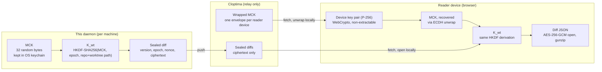
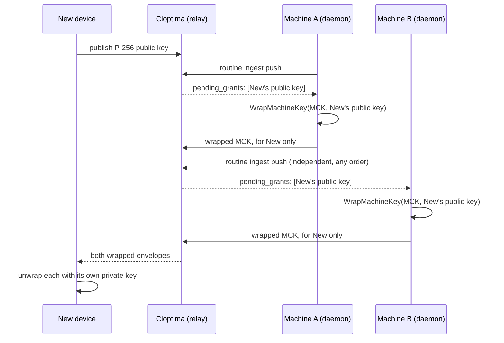

# Treehouse

Treehouse puts your machines' live git diffs in your pocket. Run it on a laptop, desktop, or headless server, and you can pull up what's changed — branch, ahead/behind, staged or not, the diff itself — from your phone or any browser, anywhere, through the Cloptima relay.

Diff content is sealed with AES-256-GCM on the machine that produced it before it's ever sent, and only opened again on a device you've explicitly signed in on. Cloptima relays the sealed bytes end to end and never holds a key that could open them. See [Encryption](#encryption) for the exact key derivation and wire format.

It ships as a single Go binary with two entrypoints: a native macOS menu bar app, and a headless CLI/daemon for Linux and terminal-only use.

It only ever opens outbound connections. It never listens for inbound traffic and never writes to the repositories it watches.

## How it works

- **Watch.** `internal/watch` uses fsnotify on each tracked repo's working tree and `.git` refs, with a 3-second debounce.
- **Diff.** `internal/git` shells out to the local `git` binary (read-only) to compute branch, ahead/behind, staged/unstaged file status, and patch text.
- **Seal.** `internal/crypto` and `internal/payload` seal the diff and apply size limits before anything leaves the machine — see [Encryption](#encryption) below.
- **Push.** `internal/ingest` POSTs the sealed snapshot to `/v1/treehouse/ingest`, bearer-authenticated with an access token scoped to this machine. Cloptima relays the sealed bytes end to end — it never receives a diff in the clear and never holds a key that could open one.
- **Retry.** A failed push backs off (30s doubling to a 6-minute ceiling, or whatever `Retry-After` the server sends) rather than retrying on every debounce tick. A 5-minute heartbeat, jittered per repo, keeps an idle machine distinguishable from a dead one.

One daemon runs per machine, enforced by an exclusive lock file (`~/.treehouse/daemon.lock`) beside its config.

## Encryption

Diff content is sealed on the machine that produced it, before it is sent, and only ever opened again on a device you've explicitly signed in on. Cloptima only ever relays that ciphertext end to end — it holds no key that opens it.

### Identity and keys

On first run, the daemon generates a machine identity (`internal/crypto/crypto.go`): a random UUID, and two 32-byte secrets —

- **MCK** (machine content key) — derives every worktree's diff key. Versioned by an `epoch` counter so a future key rotation doesn't require a format change.
- **MTK** (machine token key) — fingerprints diff content for change detection. Kept separate from MCK and never rotated, so re-keying the machine doesn't make every worktree look like it changed at once.

Both are stored as one JSON record in the OS keychain (macOS Keychain, Linux Secret Service, Windows Credential Manager) under service `treehouse-daemon`. On a host with no keychain — most commonly a headless Linux server with no D-Bus session — they fall back to `~/.treehouse/machine-identity.json` at file mode `0600`.

### Sealing a diff

Each worktree's diff is sealed under a key derived from MCK and that worktree's own paths, so a key leak is scoped to one worktree rather than the whole machine:

```
K_wt = HKDF-SHA256(
  secret = MCK,
  salt   = epoch (4 bytes, big-endian),
  info   = "th/diff/v1" ‖ len32be(repoPath) ‖ repoPath ‖ len32be(wtPath) ‖ wtPath,
)

sealed = AES-256-GCM(
  key       = K_wt,
  nonce     = random 12 bytes,
  plaintext = gzip(diff JSON),
  aad       = epoch (4 bytes, big-endian),
)
```

`repoPath` and `wtPath` are length-prefixed before concatenation so two different path pairs can never collide into the same derivation input. The epoch doubles as AEAD associated data, so ciphertext sealed under one epoch fails closed rather than decrypting under another.

What ships in the sealed body is the diff itself — file contents, patch text. Everything else needed to drive the product — which machine and repo changed, branch, ahead/behind, dirty state, and the change magnitude (files/lines changed) — travels in the clear alongside the ciphertext, computed by `internal/git` and reported by `internal/ingest.BuildWorktreePayload`.

A worktree with nothing to seal still reports a fixed per-machine content token (`CleanContentToken`, HMAC-SHA256 of a constant string under MTK) rather than an empty one, so a clean worktree stays a distinguishable, non-empty value.

### Granting a new device

The daemon never holds a reader's private key — only the public key the server hands back on the response to its own push. Wrapping MCK for one reader (`WrapMachineKey` in `internal/crypto/crypto.go`):

```
shared = ECDH(ephemeral P-256 private key, reader's P-256 public key)

KEK = HKDF-SHA256(
  secret = shared,
  salt   = none,
  info   = "th/grant/v1" ‖ len32be(instanceID) ‖ instanceID ‖ epoch (4 bytes, big-endian),
)

envelope = AES-256-GCM(key = KEK, nonce = random 12 bytes, plaintext = MCK)
```

The reader's public key is a 65-byte uncompressed SEC1 P-256 point, base64url-encoded without padding — the exact form WebCrypto's raw key export produces, so the Go and browser sides agree on wire format without a translation layer.



Granting is asynchronous per machine — each one wraps and re-pushes on its own next check-in, so enrollment order across multiple machines never matters:



Every machine wraps only its own key — a device that has been granted access by two machines ends up with two independent wrapped copies, never a shared master key.

### Source pointers

| Concern | File |
| :--- | :--- |
| Machine identity, key generation, key storage, grant wrapping | `internal/crypto/crypto.go` |
| Diff key derivation and sealing, content fingerprinting | `internal/crypto/seal.go` |
| Client-side payload size limits, applied before sealing | `internal/payload/limits.go` |
| Wire client, push/retry/backoff | `internal/ingest/client.go` |
| Cross-language fixture generator (guards Go/WebCrypto byte compatibility) | `internal/crypto/interop_gen_test.go` |

## Installation

### macOS Menu Bar App (Recommended)

```bash
brew install --cask cloptima/tap/treehouse
```

> **Gatekeeper note:** the menu bar app is ad-hoc signed for Launch at Login support. The Homebrew cask strips the quarantine attribute automatically. If installing manually from a downloaded archive, clear it yourself before first launch:
> ```bash
> xattr -dr com.apple.quarantine /Applications/Treehouse.app
> ```

### CLI / Headless Daemon (macOS & Linux)

```bash
brew install cloptima/tap/treehouse-cli
```

### Build from Source

Requirements: Go 1.25+

```bash
git clone https://github.com/cloptima/cloptima-treehouse.git
cd cloptima-treehouse
go build -trimpath -ldflags "-s -w" -o treehouse ./cmd/treehouse
```

## Getting Started

### 1. Authenticate

```bash
treehouse login
```

Or pair a headless machine via device code / QR code:

```bash
treehouse pair
```

### 2. Track Repositories

```bash
treehouse add /path/to/my-project
```

### 3. Run the Daemon

The menu bar app starts the daemon automatically. From a terminal:

```bash
treehouse run
```

To check status:

```bash
treehouse status
```

## CLI Command Reference

| Command | Description |
| :--- | :--- |
| `treehouse login` | Authenticate the workstation via browser OAuth flow |
| `treehouse pair` | Pair the workstation via device authorization code or QR code |
| `treehouse logout` | Revoke local tokens and remove credentials from the system keychain |
| `treehouse add <path>` | Track a git repository directory |
| `treehouse remove <path>` | Stop tracking a repository |
| `treehouse list` | List currently tracked repositories |
| `treehouse status` | Display workstation identity, daemon lock status, and sync state |
| `treehouse run` | Run the sync daemon in the foreground |
| `treehouse version` | Print the current version and build metadata |

## Configuration

Stored locally under `~/.treehouse/config.json`: gateway URL, machine display name, launch-at-login preference, and the tracked repo list. `TREEHOUSE_CONFIG_PATH` overrides the path.

Credentials and encryption keys live in the OS keychain under service `treehouse-daemon`; see [Encryption](#encryption) for the fallback file paths and permissions when no keychain is available.

## Development

See [CONTRIBUTING.md](CONTRIBUTING.md) for building, testing, and the project layout.

## License

Apache License 2.0 — see [LICENSE](LICENSE).
